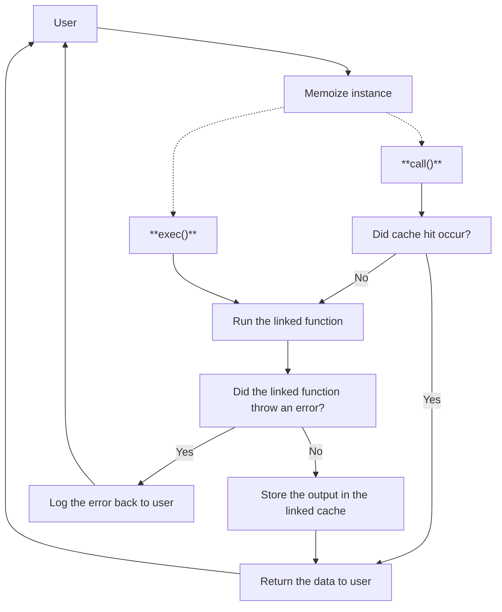

# memoose-go
An implementation of [memoose.js](https://github.com/anuragdalia/memoose-js) in Go.

## Data flow visualization for `call()` and `exec()`

```mermaid
flowchart TD
  A[User] --> B[Memoize instance]
  B -.-> C["**call()**"] & D["**exec()**"]
  C --> E[Did cache hit occur?]
  E --> |Yes| F[Return the data to user]
  F --> A
  E --> |No| G[Run the linked function]
  D --> G
  G --> H[Did the linked function throw an error?]
  H --> |No| I[Store the output in the linked cache]
  I --> F
  H --> |Yes| J[Log the error back to user]
  J --> A;
classDef node fill:#ECECFF,stroke:#9370DB,stroke-width:1px,color:#333;
class A,B,C,D,E,F,G,H,I,J node;
```
